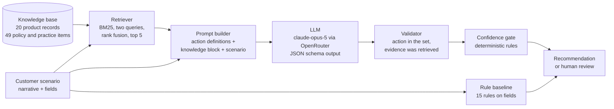

# Product documentation

## Persona

**Wei, a Forward-Deployed Engineer** at an industrial sensor supplier. She is setting up an AI
sales agent for a new account and has a pile of call notes, a product catalogue and the
company's sales policies open in three windows. For each customer situation she has to decide
what the agent should do next and write that down as an instruction the agent can follow. She
knows sales and the products reasonably well, but she does not remember every rating limit,
discount rule or minimum order quantity, and she has to look each one up.

What changes when the system works: she pastes the customer situation, gets a recommended next
action with the facts it rests on, checks the cited facts, and writes the instruction. In a
timed study this took 4.9 minutes per scenario instead of 10.7 by hand.

## Input

One customer scenario:

| Field | Example |
|---|---|
| `narrative` | Call notes in free text, 60 to 220 words |
| `sales_stage` | prospecting, qualifying, technical_review, proposal, negotiation |
| `customer_size` | small, medium, large |
| `export_oriented` | true or false |
| `has_incumbent` | true or false |
| `pain_points` | short phrases, may be empty |
| `objections` | short phrases, may be empty |

## Output

| Field | Example |
|---|---|
| `action` | one of nine: qualify_budget_authority, request_spec_review, propose_pilot_order, send_case_study, schedule_site_visit, escalate_pricing, nurture, disqualify, proceed_to_order |
| `rationale` | "The fixed requirement is 220 °C; the TS series is rated to 180 °C with no higher version planned." |
| `evidence_ids` | `["pd-003"]`, knowledge items the recommendation relies on |
| `confidence` | 0.90, the model's own estimate |
| gate decision | `pass`, or `human_review` with a reason |

The action set is closed, so a recommendation is either right or wrong against a gold label;
no model is needed to grade it.

## Architecture



Text version:

```
 scenario ──┬──────────────────────────────► rule baseline ─────────────┐
            │                                                           │
            ├──► retriever ◄── knowledge base (69 items)                │
            │        │ top 5 items                                      │
            └──► prompt builder ──► LLM (rented) ──► validator ──► gate ┴──► output
```

| Box | Code | Built or rented |
|---|---|---|
| Rule baseline | `src/vskc/systems.py` (`system_rule`) | built |
| Retriever | `src/vskc/retriever.py` | built |
| Knowledge base | `data/knowledge/` | built |
| Prompt builder | `src/vskc/prompts.py` | built |
| LLM | `src/vskc/llm.py` calls `anthropic/claude-opus-5` through OpenRouter | rented |
| Validator | pydantic models in `src/vskc/schema.py` | built |
| Gate | `src/vskc/gate.py` | built |
| Web interface | `src/vskc/api.py` (FastAPI) and `src/vskc/web/` | built on rented libraries |
| Evaluation | `scripts/run_eval.py`, `scripts/report.py`, `src/vskc/metrics.py` | built |

The generic-LLM system is the same pipeline with an empty knowledge block. The three systems
share one input and one output type, so they can be compared directly.

## Metrics targeted and reached

Targets were written down in the project plan on 2026-09-29, before any held-out scenario
existed. The problem statement left the size of the margin over the generic LLM to be decided
after a pilot; no numeric margin was fixed, so none is claimed.

| Metric | Target | Reached on held-out (80 scenarios) | Met |
|---|---|---|---|
| Next-best-action accuracy, RAG | Above the generic LLM, the rule baseline and the majority class | RAG 78.8%, generic LLM 72.5%, rule 36.2%, majority 28.7% | Ordering yes. RAG over generic LLM is not significant overall (p = 0.30) and is significant on the 30 clear-label cases (93.3% vs 66.7%, p = 0.008) |
| Abstention | More than half of the cases sent to human review would otherwise have been wrong | 26.2% of escalated cases would have been wrong; 81.3% of cases were escalated | No. Thresholds chosen on dev did not transfer |
| Leakage | Report the score before and after removing leaking sentences | 3 sentences in 3 scenarios removed; no correctness change on them | Reported |
| Configuration effort | Measure the time to write an agent instruction by hand and with the system | 10.65 min by hand, 4.86 min with the system, 54% less | Measured, 6 scenarios |
| Cost | Report cost per scenario | RAG about USD 0.02, generic LLM about USD 0.015 | Reported |

Details: [EVALS.md](EVALS.md). Data: [DATA.md](DATA.md).
