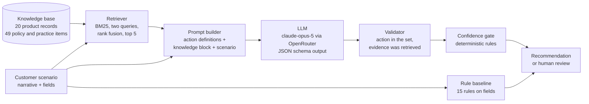

# Vertical Sales Knowledge Compiler

Turns vertical sales knowledge into a grounded next-best-action recommendation for a
Forward-Deployed Engineer (FDE) who configures a B2B sales agent. Domain: industrial
sensors, export-oriented manufacturing. Course project for PE6201, NTU.

```
one customer scenario -> one retrieval step -> one model call -> one structured recommendation
```

The output is an action from a closed set of nine, a short rationale, the knowledge
items it relied on, a confidence score, and a human-review flag.

## Contents

- [1. Overview](#1-overview)
  - [1.1 What is compared](#11-what-is-compared)
  - [1.2 Documentation files](#12-documentation-files)
- [2. Getting started](#2-getting-started)
  - [2.1 Reproduce the tables without an API key](#21-reproduce-the-tables-without-an-api-key)
  - [2.2 Run the tests](#22-run-the-tests)
  - [2.3 Run it yourself](#23-run-it-yourself)
- [3. Repository layout](#3-repository-layout)
- [4. Product](#4-product)
  - [4.1 Persona](#41-persona)
  - [4.2 Input](#42-input)
  - [4.3 Output](#43-output)
  - [4.4 Architecture](#44-architecture)
  - [4.5 Build or rent](#45-build-or-rent)
  - [4.6 Metrics targeted and reached](#46-metrics-targeted-and-reached)
- [5. Data](#5-data)
  - [5.1 A scenario record](#51-a-scenario-record)
  - [5.2 Dev set: 40 scenarios](#52-dev-set-40-scenarios)
  - [5.3 Held-out set: 80 scenarios](#53-held-out-set-80-scenarios)
  - [5.4 Knowledge base: 69 items](#54-knowledge-base-69-items)
  - [5.5 Configuration-time study scenarios: 6](#55-configuration-time-study-scenarios-6)
  - [5.6 Checks you can run](#56-checks-you-can-run)
- [6. Evaluations](#6-evaluations)
  - [6.1 Systems compared](#61-systems-compared)
  - [6.2 The evals in this repository](#62-the-evals-in-this-repository)
  - [6.3 Discipline](#63-discipline)
  - [6.4 Discipline in detail](#64-discipline-in-detail)
  - [6.5 Design decisions fixed before the held-out set existed](#65-design-decisions-fixed-before-the-held-out-set-existed)
  - [6.6 Results](#66-results)
  - [6.7 Critique of the evals](#67-critique-of-the-evals)
  - [6.8 Tuning done on dev](#68-tuning-done-on-dev)
- [7. FDE configuration-time study](#7-fde-configuration-time-study)
- [8. Intended use and limits](#8-intended-use-and-limits)

## 1. Overview

### 1.1 What is compared

| System | What it sees |
|---|---|
| Rule-based baseline | Structured fields only. No model. |
| Generic LLM | The scenario. Same prompt as below, with an empty knowledge block. |
| Vertical RAG + LLM | The scenario plus the top-k knowledge items from BM25 retrieval. |

Accuracy is exact match against the gold label, reported next to the
majority-class baseline.

### 1.2 Documentation files

| File | Contents |
|---|---|
| [PRODUCT.md](PRODUCT.md) | Persona, input, output, architecture diagram, metrics targeted and reached |
| [DATA.md](DATA.md) | Every data file: where it came from, how it was built and checked |
| [EVALS.md](EVALS.md) | Every evaluation: what it measures, how to run it, results and critique |

The full text of all three is also reproduced in sections 4, 5 and 6 of this README.

Each source file starts with a docstring describing what it does.

## 2. Getting started

### 2.1 Reproduce the tables without an API key

Every model call is logged under `results/raw/` and every prediction under
`results/runs/`. The report is built from those files only.

```bash
python -m venv .venv
.venv\Scripts\activate            # Windows.  macOS/Linux: source .venv/bin/activate
pip install -e ".[dev]"
python scripts/report.py
```

Tables are written to `results/tables/`.

Tested with Python 3.12 on Windows, in a fresh clone. On Windows, clone into a short path
such as `C:\vskc`: some installed packages have deep file paths that exceed the default
260-character path limit when the folder is nested deeply.

### 2.2 Run the tests

```bash
pytest
```

The tests use mock replies and small fixture files. They call no model and need no key.

### 2.3 Run it yourself

1. Copy `.env.example` to `.env`. Set the API key and the three model slugs.
2. Check the setup. This makes no model call.

   ```bash
   python scripts/check_setup.py
   python scripts/check_setup.py --models anthropic
   ```

3. Validate the data, evaluate on dev, choose thresholds, then run held-out once.

   ```bash
   python scripts/validate_data.py
   python scripts/eval_retrieval.py
   python scripts/leakage_check.py --split dev
   python scripts/run_eval.py --split dev
   python scripts/run_eval.py --split dev --variant stripped
   python scripts/tune_gate.py --run-id <dev run id>

   python scripts/leakage_check.py --split heldout
   python scripts/run_eval.py --split heldout
   python scripts/run_eval.py --split heldout --variant stripped
   python scripts/report.py
   ```

4. Web interface.

   ```bash
   python -m vskc.api
   ```

   Open http://127.0.0.1:8000. The **Workbench** replays what each system answered in the
   evaluation run (no model call, no cost), or calls the model live on a held-out, dev or
   custom scenario. Each answer shows the action, the rationale, the confidence, the gate
   decision and the cited knowledge items. **Results** shows the held-out accuracy,
   subsets, paired tests, the gate and cost. The page is served by FastAPI and is plain
   HTML and JavaScript with no build step; the JSON API is documented at `/api/docs`.
   Deep links such as `/#heldout/ho-022`, `/#results` and `/#heldout/ho-022/hide` (gold
   labels hidden) are useful for demonstrations.

   A simpler Streamlit page is kept as a fallback: `streamlit run src/vskc/app.py`.

Add `--mock` to `run_eval.py` to exercise the pipeline with deterministic fake replies.
Mock runs are labeled as such and excluded from the summary.

## 3. Repository layout

```
src/vskc/        schema, retriever, prompts, model gateway, three systems, gate, metrics
src/vskc/api.py  FastAPI app: JSON API and the web page in src/vskc/web/
scripts/         data validation, leakage check, evaluation, threshold tuning, report, generation
data/gold/       40 labeled scenarios, fixed before the knowledge base
data/knowledge/  playbook, product records, customer SOPs, past outcomes
data/scenarios/  dev and held-out scenario files, raw and leakage-stripped
results/annotation/  second annotator's labels
results/study/   configuration-time study: timings and the model calls made
data/study/      the six configuration-time study scenarios
results/raw/     one line per model call, including failed attempts
results/runs/    predictions and run metadata
results/tables/  generated tables
tests/           unit tests and an end-to-end mock run
```

## 4. Product

### 4.1 Persona

**Wei, a Forward-Deployed Engineer** at an industrial sensor supplier. She is setting up an AI
sales agent for a new account and has a pile of call notes, a product catalogue and the
company's sales policies open in three windows. For each customer situation she has to decide
what the agent should do next and write that down as an instruction the agent can follow. She
knows sales and the products reasonably well, but she does not remember every rating limit,
discount rule or minimum order quantity, and she has to look each one up.

What changes when the system works: she pastes the customer situation, gets a recommended next
action with the facts it rests on, checks the cited facts, and writes the instruction. In a
timed study this took 4.9 minutes per scenario instead of 10.7 by hand.

### 4.2 Input

One customer scenario:

| Field | Example |
|---|---|
| `narrative` | Call notes in free text, 60 to 220 words |
| `sales_stage` | prospecting, qualifying, technical_review, proposal, negotiation |
| `customer_size` | small, medium, large |
| `export_oriented` | true or false |
| `has_incumbent` | true or false |
| `pain_points` | short phrases, may be empty |
| `objections` | short phrases, may be empty |

### 4.3 Output

| Field | Example |
|---|---|
| `action` | one of nine: qualify_budget_authority, request_spec_review, propose_pilot_order, send_case_study, schedule_site_visit, escalate_pricing, nurture, disqualify, proceed_to_order |
| `rationale` | "The fixed requirement is 220 °C; the TS series is rated to 180 °C with no higher version planned." |
| `evidence_ids` | `["pd-003"]`, knowledge items the recommendation relies on |
| `confidence` | 0.90, the model's own estimate |
| gate decision | `pass`, or `human_review` with a reason |

The action set is closed, so a recommendation is either right or wrong against a gold label;
no model is needed to grade it.

### 4.4 Architecture



Text version:

```
 scenario ──┬──────────────────────────────► rule baseline ─────────────┐
            │                                                           │
            ├──► retriever ◄── knowledge base (69 items)                │
            │        │ top 5 items                                      │
            └──► prompt builder ──► LLM (rented) ──► validator ──► gate ┴──► output
```

| Box | Code | Built or rented |
|---|---|---|
| Rule baseline | `src/vskc/systems.py` (`system_rule`) | built |
| Retriever | `src/vskc/retriever.py` | built |
| Knowledge base | `data/knowledge/` | built |
| Prompt builder | `src/vskc/prompts.py` | built |
| LLM | `src/vskc/llm.py` calls `anthropic/claude-opus-5` through OpenRouter | rented |
| Validator | pydantic models in `src/vskc/schema.py` | built |
| Gate | `src/vskc/gate.py` | built |
| Web interface | `src/vskc/api.py` (FastAPI) and `src/vskc/web/` | built on rented libraries |
| Evaluation | `scripts/run_eval.py`, `scripts/report.py`, `src/vskc/metrics.py` | built |

The generic-LLM system is the same pipeline with an empty knowledge block. The three systems
share one input and one output type, so they can be compared directly.

### 4.5 Build or rent

| Layer | Choice | Own or rent |
|---|---|---|
| Interface | Single HTML page, no framework | own |
| Serving | FastAPI JSON API, so the recommendation can be called by an execution-layer platform | own (FastAPI and Uvicorn are rented libraries) |
| Orchestration | Python | own |
| Knowledge schema | Pydantic models, closed action set | own |
| Retrieval | BM25, implemented in `retriever.py` | own |
| Strategy compiler | Prompt plus JSON Schema output | own |
| Confidence gate | Deterministic rules | own |
| Evaluation | Scripts in this repository | own |
| Foundation model | Hosted model through OpenRouter, slug in `.env` | rent |
| Prospecting, CRM, outreach | Existing sales platforms | rent, out of scope |

### 4.6 Metrics targeted and reached

Targets were written down in the project plan on 2026-09-29, before any held-out scenario
existed. The problem statement left the size of the margin over the generic LLM to be decided
after a pilot; no numeric margin was fixed, so none is claimed.

| Metric | Target | Reached on held-out (80 scenarios) | Met |
|---|---|---|---|
| Next-best-action accuracy, RAG | Above the generic LLM, the rule baseline and the majority class | RAG 78.8%, generic LLM 72.5%, rule 36.2%, majority 28.7% | Ordering yes. RAG over generic LLM is not significant overall (p = 0.30) and is significant on the 30 clear-label cases (93.3% vs 66.7%, p = 0.008) |
| Abstention | More than half of the cases sent to human review would otherwise have been wrong | 26.2% of escalated cases would have been wrong; 81.3% of cases were escalated | No. Thresholds chosen on dev did not transfer |
| Leakage | Report the score before and after removing leaking sentences | 3 sentences in 3 scenarios removed; no correctness change on them | Reported |
| Configuration effort | Measure the time to write an agent instruction by hand and with the system | 10.65 min by hand, 4.86 min with the system, 54% less | Measured, 6 scenarios |
| Cost | Report cost per scenario | RAG about USD 0.02, generic LLM about USD 0.015 | Reported |

Details: [EVALS.md](EVALS.md). Data: [DATA.md](DATA.md).

## 5. Data

All data in this repository is synthetic. There is no real customer, person or company in it.
Every file is JSONL: one JSON object per line.

| File | Records | What it is | Used for |
|---|---|---|---|
| `data/gold/seed_40.jsonl` | 40 | Dev scenarios with labels | Tuning the prompt, the retrieval and the gate |
| `data/gold/archive/seed_40.v1_draft.jsonl` | 40 | First draft of the dev set, kept for the record | Nothing; history only |
| `data/gold/retrieval_needs.json` | 15 | Dev scenarios that need a specific knowledge item, and which item | Measuring retrieval recall |
| `data/scenarios/heldout.jsonl` | 80 | Held-out scenarios with labels | Final evaluation, run once |
| `data/scenarios/heldout_stripped.jsonl` | 80 | Held-out with leaking sentences removed | Leakage check |
| `data/knowledge/products.jsonl` | 20 | Product records | Retrieved by the RAG system |
| `data/knowledge/playbook.jsonl` | 49 | Sales policies and sales practice | Retrieved by the RAG system |
| `data/study/config_study.jsonl` | 6 | Unlabeled scenarios for the configuration-time study | Timing, not accuracy |

### 5.1 A scenario record

```json
{
  "id": "ho-022",
  "narrative": "Met with Dave and the engineering team at Apex Heavy Pipe ... the sensor head has to run continuously at 220 degrees Celsius. The customer states that this requirement cannot be changed. ...",
  "sales_stage": "technical_review",
  "customer_size": "large",
  "export_oriented": false,
  "has_incumbent": true,
  "pain_points": ["current vendor's units keep failing early", "excessive downtime"],
  "objections": [],
  "label": "disqualify",
  "label_rationale": "A continuous 220 degrees Celsius at the sensor head exceeds every applicable rating ...",
  "meta": {"label_certainty": "clear", "depends_on_supplier_fact": true, "...": "provenance"}
}
```

`label`, `label_rationale` and `meta` are removed before a scenario is given to any system
(`Scenario.without_label()` in `src/vskc/schema.py`). The rule baseline reads only the
structured fields, never the narrative.

### 5.2 Dev set: 40 scenarios

- Drafted, revised once, and every label reviewed by me. Fixed and committed
  before any knowledge item existed (commit `a4dde59`), so the knowledge base could not be
  written to fit the labels.
- Balanced by design: each of the first eight actions 5 times, each sales stage 8 times,
  8 scenarios with conflicting statements, narratives from 82 to 194 words.
- The first draft was too easy: a model with no knowledge base answered all 40 correctly,
  because narratives ruled out the other actions and stated supplier facts. The narratives,
  pain points and objections were revised once; labels were not changed. The draft is kept in
  `data/gold/archive/`.
- After revision a model with no knowledge base still scores 95%. The dev set is therefore
  used for tuning only, not as evidence that the knowledge base helps.
- The dev set cannot be regenerated from a script. It is a fixed, reviewed dataset; both
  the first draft and the revised version are in the repository.

### 5.3 Held-out set: 80 scenarios

Generated by `scripts/gen_scenarios.py`, then labeled and reviewed.

1. **Sampling grid** (`src/vskc/generation.py`): 80 combinations of sales stage, customer
   size, export orientation, incumbent, objection type, specification status, purchase timing
   and length, with near-uniform marginals; 15% made deliberately contradictory.
2. **Supplier-fact hooks**: 32 scenarios (40%) carry a customer requirement whose answer
   depends on a fact only the knowledge base states, for example a required temperature
   against the 180 °C rating of the temperature sensors. Each hook has a version the supplier
   can meet and one it cannot. The generator is told only the customer's requirement, never
   what the supplier can do.
3. **Generation**: `google/gemini-3.8-flash`, a different vendor from the model under test,
   in a different narrative style (informal call notes) from the dev set.
4. **Labeling**: each label written with a rationale and marked `clear` (30) or `judgment`
   (50, with a recorded alternative action).
5. **Second annotator**: `openai/gpt-6-sol` labeled all 80 independently with the whole
   knowledge base in view. Agreement 78.8%, Cohen's kappa 0.74
   (`results/annotation/second_heldout.jsonl`). Two labels were corrected after this check.
6. **Review and lock**: I reviewed all 80 labels and committed them before any system was run
   on them (commit `a694276`).

Label distribution: request_spec_review 23, disqualify 15, nurture 13, proceed_to_order 7,
schedule_site_visit 6, escalate_pricing 6, send_case_study 5, qualify_budget_authority 3,
propose_pilot_order 2. Majority class 28.7%.

Known rough edges: the grid samples factors independently, so some combinations are unusual;
in five narratives the generator stated a supplier fact that conflicts with the knowledge base
(flagged in `meta.narrative_states_supplier_fact`, kept as generated).

### 5.4 Knowledge base: 69 items

Written after the dev labels were locked (commit `5f75df5`), for an invented supplier with
plausible specifications.

| Group | Items | Examples |
|---|---|---|
| Product records `pd-001` to `pd-020` | 20 | TS temperature sensors rated to 180 °C, no higher version; FL flow sensors up to 2,000 mPa·s; RE encoders incremental only; no ATEX or third-party hygienic certification |
| Sales policies `pb-001` to `pb-008` | 8 | Sales staff may approve up to 5% discount; custom housings from 300 units; lead times; audits |
| Sales and sourcing practice `pb-009` to `pb-049` | 41 | Qualification (budget, signatory, timing); hard requirement vs timing problem; doubt about a product vs doubt about a supplier; supplier admission audits |

Rules followed when writing it: state general principles and facts, never "in situation X do
Y"; do not paraphrase any label rationale (the highest word overlap with any rationale is
0.19); cover more than the scenarios need, as a real catalogue would.

### 5.5 Configuration-time study scenarios: 6

Generated by `scripts/gen_config_study.py` with a fixed design: two groups of three, matched
by type. Unlabeled, because the study measures time. Two narratives had one product detail
corrected to agree with the knowledge base; the edits are recorded in `meta.edits`.

### 5.6 Checks you can run

```bash
python scripts/validate_data.py      # schema, ids, quotas
python scripts/leakage_check.py --split heldout
python scripts/eval_retrieval.py     # recall of the needed knowledge items on dev
```

## 6. Evaluations

Every number below can be recomputed without an API key: `python scripts/report.py` reads
the logged runs in `results/` and writes the tables to `results/tables/`.

### 6.1 Systems compared

| System | Sees |
|---|---|
| Majority class | Nothing; always answers the most common gold label |
| Rule baseline | Structured fields only, 15 ordered rules |
| Generic LLM | The scenario, with an empty knowledge block |
| Vertical RAG + LLM | The scenario and the 5 retrieved knowledge items |

The generic LLM and the RAG system use the same prompt; the knowledge block is the only
difference (a test enforces this).

### 6.2 The evals in this repository

| Eval | Question it answers | Script | Output |
|---|---|---|---|
| Next-best-action accuracy | How often is the recommended action the gold action? | `scripts/run_eval.py`, `scripts/report.py` | T1 |
| Paired comparison | Is the difference between two systems more than chance? Exact McNemar test on the same scenarios | `scripts/report.py` | T6 |
| Accuracy by subset | Where does the knowledge base help? By supplier-fact dependence, label certainty, stage, size | `scripts/report.py` | T3 |
| Abstention | How often does the gate escalate, and are escalated cases the ones that would be wrong? | `scripts/tune_gate.py`, `scripts/report.py` | T2 |
| Leakage | Does the input already contain the answer? Score before and after removing leaking sentences | `scripts/leakage_check.py` | summary |
| Retrieval recall | Is the needed knowledge item among the 5 retrieved? | `scripts/eval_retrieval.py` | table |
| Label agreement | Do two independent annotators agree on the held-out labels? | `scripts/second_annotator.py` | Cohen's kappa |
| Cost and latency | What does one recommendation cost? | `scripts/report.py` | T4 |
| Configuration time | How long does an FDE take to write an agent instruction, by hand and with the system? | stopwatch; `results/study/` | README |

### 6.3 Discipline

- Labels before knowledge: dev labels committed before the knowledge base (`a4dde59`, then `5f75df5`).
- Held-out labels committed before any system ran on them (`a694276`).
- Held-out is run once. `run_eval.py` refuses a second run unless `--force --reason` is given; the reason is recorded.
- Gate thresholds must exist before held-out runs; `tune_gate.py` refuses a held-out run.
- A reply that fails validation twice counts as wrong.
- Every model call, including failed attempts, is logged in `results/raw/`.

### 6.4 Discipline in detail

- **Labels before knowledge.** The 40 gold labels were fixed and committed before any
  knowledge item existed. See the commit history.
- **Held-out is run once.** `run_eval.py` refuses a second held-out run unless `--force`
  is given with a reason, which is recorded in the run metadata.
- **Thresholds are fixed first.** Held-out will not run until `results/gate.json` exists.
  `tune_gate.py` refuses to tune on a held-out run.
- **Leakage is measured.** Sentences that name an action or give advice are removed to
  produce a stripped variant. Scores are reported before and after.
- **Failures stay in the denominator.** A reply that fails validation twice counts as a
  wrong answer.
- **Generation never labels.** The scenario generator has no target action. Labels are
  assigned afterwards, and every label is reviewed by a person before any system is run
  on the file.
- **Held-out labels were checked.** A second annotator, a model from a different vendor
  than the model under test, labeled all 80 held-out scenarios independently with the
  whole knowledge base in view. Agreement is 78.8 percent, Cohen's kappa 0.74. Each label
  is marked `clear` or `judgment`, and accuracy is reported for both groups. Reproduce
  with `python scripts/second_annotator.py --split heldout`.
- **Same prompt for both model systems.** The generic LLM and the RAG system differ only
  in whether the knowledge block is empty.

### 6.5 Design decisions fixed before the held-out set existed

These were committed before any held-out scenario was generated.

**Held-out composition.** 80 scenarios. At least 40 percent carry a customer requirement
whose consequence depends on a fact that only the knowledge base states, such as a
product's temperature limit or the minimum quantity for a custom housing. Each such
requirement is generated in two versions, one the supplier can meet and one it cannot,
so the fact changes the right action. The generator is told the customer's requirement
only. It is never told what the supplier can do. Accuracy is reported separately for
scenarios that depend on a supplier fact and for those that do not.

Reason: on the 40 dev scenarios a model with no knowledge base already scores 95
percent, and every one of its errors is a scenario that needs a supplier fact. A
held-out set without such scenarios could not show whether the knowledge base matters.

**Retrieval.** BM25 with two queries per scenario, the narrative and the pain point and
objection phrases, merged by reciprocal rank fusion, top 5. On the 15 dev scenarios that
need a supplier fact this retrieves the needed item for 15, against 12 for a single
query. Reproduce with `python scripts/eval_retrieval.py`. The mode was chosen on dev,
so that recall is optimistic.

**Gate thresholds.** The RAG system made no wrong answer on dev, so thresholds cannot be
learned from errors. They are set to the 10th percentile of the dev confidence and of
the dev retrieval score: a case is escalated when the system is less confident, or the
knowledge base matches less well, than on nine in ten dev cases. Values are in
`results/gate.json`.

**Ninth action.** `proceed_to_order` was added on 2026-09-30, after the held-out
scenarios were generated and before any system was run on them. The first eight actions
each address a barrier. Reading the generated scenarios showed that about one in eight has
no barrier: requirements met, terms accepted, customer ready to order. Without a ninth
action those scenarios would have no correct label. The 40 dev labels are unchanged, and
dev was re-run with the nine-action prompt (prompt version p2) before thresholds were set.

### 6.6 Results

#### 6.6.1 Dev, 40 scenarios (tuning only)

| Majority | Rule | Generic LLM | RAG |
|---|---|---|---|
| 12.5% | 45.0% | 95.0% | 100% |

#### 6.6.2 Held-out, 80 scenarios (run `heldout-raw-20261002`)

| System | Accuracy | 95% CI |
|---|---|---|
| Majority class | 28.7% | 20.0 to 39.5 |
| Rule baseline | 36.2% | 26.6 to 47.2 |
| Generic LLM | 72.5% | 61.9 to 81.1 |
| Vertical RAG + LLM | 78.8% | 68.6 to 86.3 |

| Subset | Rule | Generic LLM | RAG | RAG vs LLM, exact McNemar p |
|---|---|---|---|---|
| All, 80 | 36.2% | 72.5% | 78.8% | 0.302 |
| Depends on a supplier fact, 32 | 34.4% | 56.2% | 71.9% | 0.267 |
| No supplier fact, 48 | 37.5% | 83.3% | 83.3% | 1.000 |
| Clear label, 30 | 30.0% | 66.7% | 93.3% | **0.008** |
| Judgment label, 50 | 40.0% | 76.0% | 70.0% | 0.453 |

Both model systems beat the rule baseline (p < 0.001).

#### 6.6.3 Gate on held-out

| Abstain rate | Escalated cases that would be wrong | Accuracy on answered cases |
|---|---|---|
| 81.3% (65/80) | 26.2% (17/65) | 100% (15/15) |

#### 6.6.4 Retrieval recall on dev

| k = 3 | k = 5 | k = 8 |
|---|---|---|
| single query 11/15, fused 14/15 | single 12/15, fused 15/15 | single 14/15, fused 15/15 |

### 6.7 Critique of the evals

- **Small samples.** 80 held-out scenarios give 95% intervals about 18 points wide. The
  overall RAG advantage of 6 points is inside the noise; only the clear-label subset shows a
  significant difference.
- **Run-to-run variation.** The leakage-stripped run changed only 3 sentences, none of which
  changed correctness, yet RAG scored 83.8% and the generic LLM 68.8%. All changes happened
  on unchanged scenarios: the model does not answer identically twice. A few points between
  systems are within this variation. The first run is the reported result.
- **Label quality.** 50 of 80 held-out labels are judgment calls. On these, the systems and
  the second annotator disagree more, and RAG does not beat the generic LLM. The clear-label
  result carries more weight.
- **Independent data sources.** Held-out was generated and second-annotated by models from
  two vendors other than that of the model under test, so the test scenarios and the check
  on their labels do not share the tested model's blind spots.
- **The gate did not transfer.** Thresholds came from the 10th percentile of dev confidence
  and retrieval score. Dev narratives are clean and close to the knowledge base wording, so
  scores were high; held-out narratives are informal notes, so 81% of cases fell below. The
  escalated cases were only slightly more likely to be wrong (26% vs 21% overall). Thresholds
  were not re-tuned on held-out. A gate needs calibration data that looks like production.
- **Synthetic data.** No result here was checked against real accounts. The results show
  how the systems behave on this data and that knowledge helps where a supplier fact decides
  the answer; they do not show performance on live customers.
- **Self-timed study.** The configuration-time study has six scenarios, timed and judged by
  the developer.

### 6.8 Tuning done on dev

| Change | Evidence | Run |
|---|---|---|
| Single query to fused retrieval | Recall at k = 5 from 12/15 to 15/15 | `scripts/eval_retrieval.py` |
| Revised dev narratives | Generic LLM fell from 100% to 95%; narratives no longer gave the answer away | archive vs current gold |
| Ninth action `proceed_to_order` | About ten held-out scenarios had no open barrier; added before the held-out run, dev re-run unchanged | `dev-raw-20260930-c` |
| Gate rule: percentile instead of accuracy | RAG made no error on dev, so accuracy-based thresholds could not be learned | `results/gate.json` |

## 7. FDE configuration-time study

The problem statement claims the system reduces the effort of configuring a sales agent.
Accuracy does not measure that, so I timed it.

**Design.** Six new scenarios, none in dev or held-out, generated by
`scripts/gen_config_study.py` into `data/study/config_study.jsonl`. Two groups of three,
matched by type: one decision that depends on a supplier fact, one price objection, one
other concern. For each scenario I wrote a sales-agent instruction meeting the same
seven-point standard: next action, rationale, knowledge cited, what to tell the customer,
what not to promise, whether to escalate, and a self-check against the scenario. Group A
by hand with only the knowledge base text; group B with the web interface in live mode.
The two conditions alternated (manual, system, manual, ...) so that growing familiarity
was shared between them. Time ran on a stopwatch from the first word read to the last
checklist item met.

| Pair | By hand | With the system | Saved |
|---|---|---|---|
| Supplier fact (cs-01, cs-02) | 10.70 min | 5.57 min | 5.13 min |
| Price objection (cs-03, cs-04) | 11.50 min | 4.43 min | 7.07 min |
| Other concern (cs-05, cs-06) | 9.75 min | 4.57 min | 5.18 min |
| **Mean** | **10.65 min** | **4.86 min** | **5.79 min, 54%** |

All six instructions met the standard, and I adopted the system's recommendation in all
three system cases. The model's response took 2.5 to 3.8 seconds, about 1 percent of the
system condition; the rest was reading, entering the scenario, checking the cited
evidence and writing the instruction. The RAG call cost about USD 0.016 per scenario.

Records: `results/study/config_time_study.csv`; the model calls made in the system
condition are in `results/study/system_condition_calls_20261002.jsonl`.

Limits: six scenarios, so this shows a magnitude, not a tested difference. I am the
developer, I know the knowledge base and the action set, and I judged the quality of my
own instructions. The two groups used different scenarios, matched by type but not
identical in difficulty. Two generated scenarios had one product detail corrected to
match the knowledge base; the edits are recorded in `meta.edits`.

## 8. Intended use and limits

Intended use: decision support for FDEs and sales implementation teams.

Not for: contacting customers, negotiating prices, making binding commercial
commitments, or replacing human approval of strategic decisions. The system has no tool
that acts on any external system.

Known limits:

- All data is synthetic. No real customer data is used. Results say how the systems
  behave on this data, not how they would behave in a live account.
- Labels reflect one reviewer's judgement. On held-out, 50 of the 80 labels are judgement
  calls where another action is defensible; the recorded alternative is in each record's
  `meta`. Results on the 30 clear labels carry more weight.
- Leakage was negligible: the filter removed 3 sentences from 3 held-out scenarios, and
  neither model system changed its correctness on those three. The stripped run therefore
  works as a second run on nearly unchanged input. Between the two runs the generic LLM
  changed its answer on 5 of 80 scenarios and the RAG system on 4. Every change in
  correctness, 3 for the generic LLM and 4 for RAG, happened on unchanged scenarios.
  Differences of a few points between systems are within this run-to-run variation. The
  first held-out run is the reported result; the second is reported alongside it.
- Held-out scenarios are generated from independently sampled attributes, so some
  combinations are unusual, and in five of them the generator stated a supplier-side
  fact that conflicts with the knowledge base. They were kept as generated and flagged.
- The silent failure to watch for is a recommendation that reads as commercially
  plausible and is wrong for the customer's industry. The gate escalates low-confidence
  and uncovered cases, and the report states how many escalated cases would have been
  wrong.
- Knowledge text is treated as data. The prompt tells the model not to follow
  instructions inside it, and the output is restricted to the closed action set.
